# Book Store Application

This readme presents the key features of a Book Store application for purchasing and managing books. The application is built using the MERN stack (MongoDB, ExpressJS, ReactJS, NodeJS) and utilizes several tools such as REDUX and JWT.

## Technologies Used

The Book Store application is built using the following technologies:

- **MongoDB**: A NoSQL database that stores information related to books, users, and other entities relevant to the application.

- **ExpressJS**: A JavaScript framework for server-side development that facilitates the creation of routes, request handlers, and business logic for the application.

- **ReactJS**: A JavaScript library for building the user interface, enabling the creation of reusable components and easy interaction with the server's API.

- **NodeJS**: A server-side JavaScript runtime environment that allows the development of high-performance and scalable web applications.

- **REDUX**: A library for managing application state, enabling predictable state updates and efficient data flow between components.

- **JWT**: JSON Web Tokens are used for authentication and authorization in the application, providing secure access to protected routes and resources.

## Key Features

The Book Store application offers the following key features:

### User Part

1. **Home page**: This page represents the landing page of our store.

   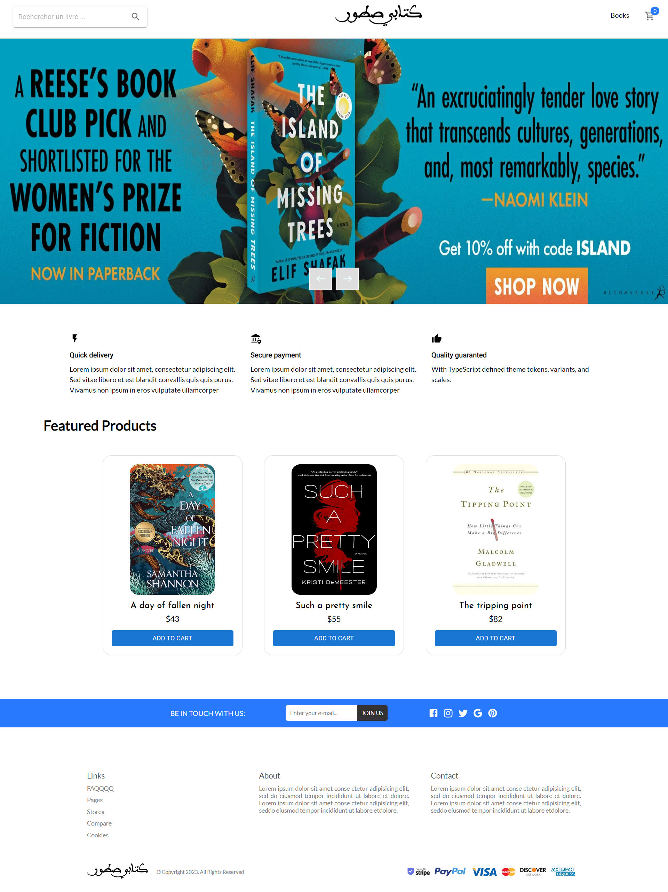

2. **Book Catalog**: Users can browse and search for books available in the store. The catalog provides details such as book title, author, description, pricing information, and cover images.

   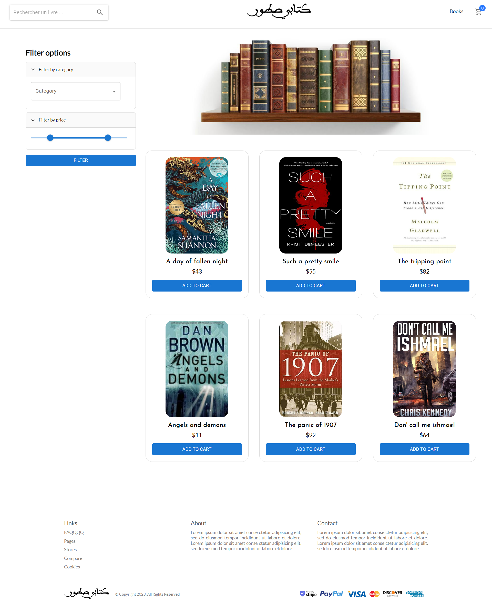

3. **Shopping Cart**: Users can add books to their shopping carts, review the contents, and proceed to the checkout process to purchase the selected books.

   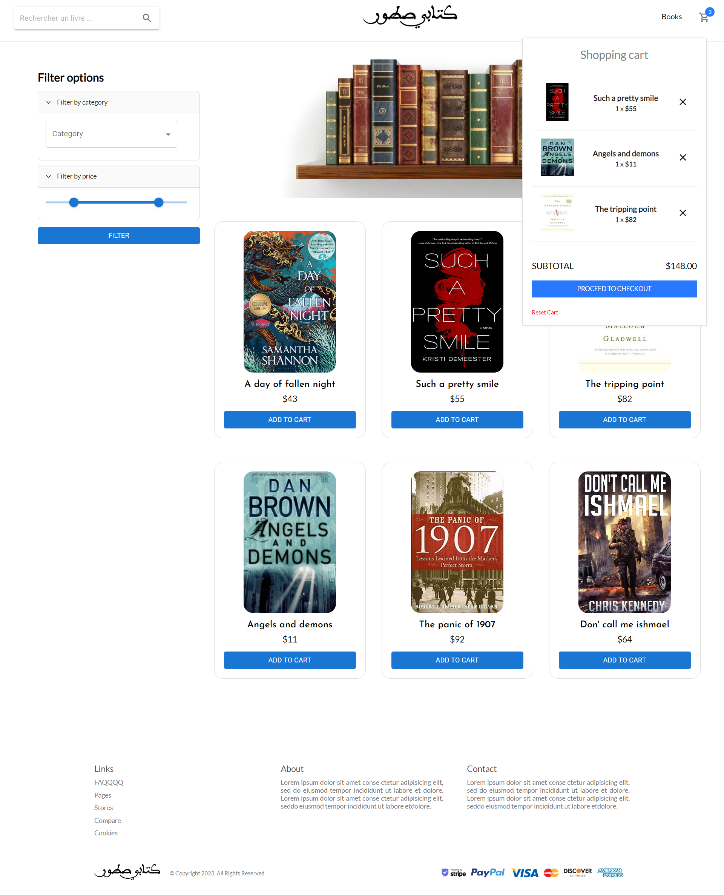

4. **Checkout and Payment**: Users can proceed to the checkout page where they can review their selected books, enter their shipping and billing information, and choose the payment method.

   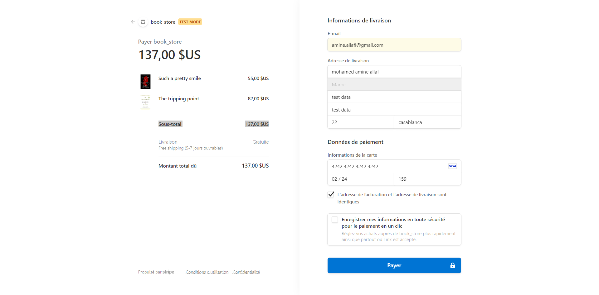

5. **Stripe Payment**: Users can make payments using the Stripe payment gateway, ensuring secure and seamless transactions.

   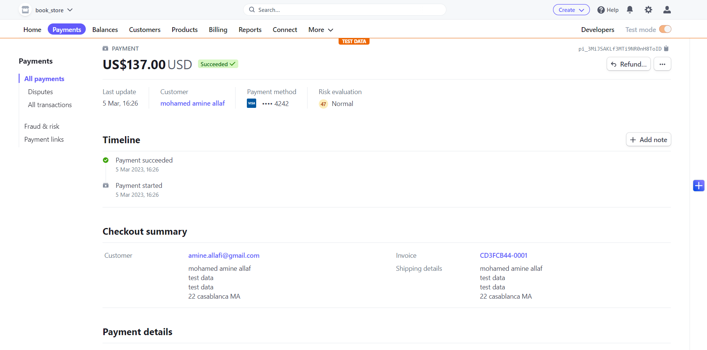
   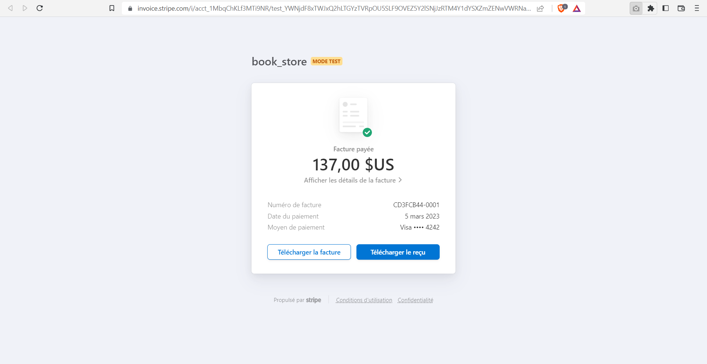

6. **Order Management**: Users can view and manage their order history, including order status, tracking information, and past purchases.

   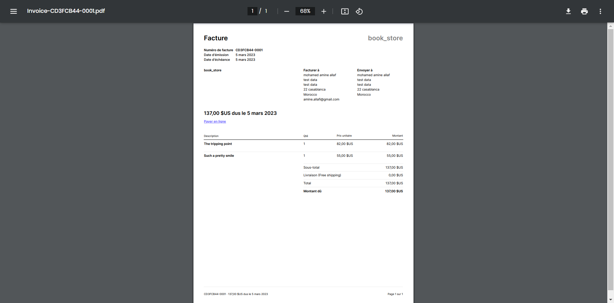

7. **Search and Filtering**: The application provides search functionality to find books based on criteria such as title, author, genre, or keywords. Users can also filter and sort search results according to their preferences.

8. **Responsive Design**: The application is designed to be responsive and accessible across different devices and screen sizes, ensuring a seamless user experience on desktops, tablets, and mobile devices.

### Admin Part

1. **Admin Authentication**: Admin users can log in to access the admin panel, where they have additional privileges and functionalities.

   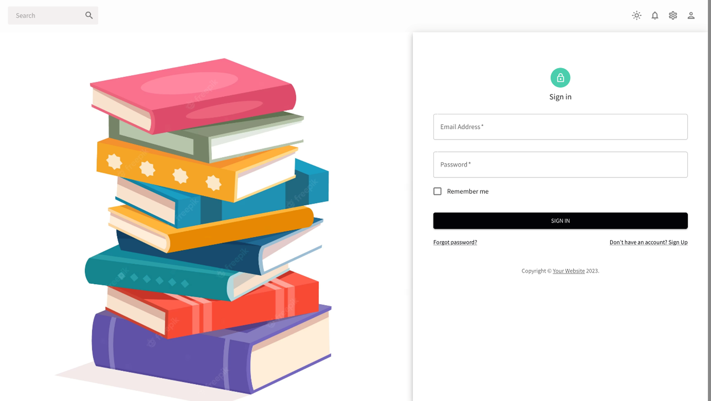

2. **Book Management**: Admin users can add new books, update existing book details, and remove books from the catalog. They can also upload and manage cover images for books.

   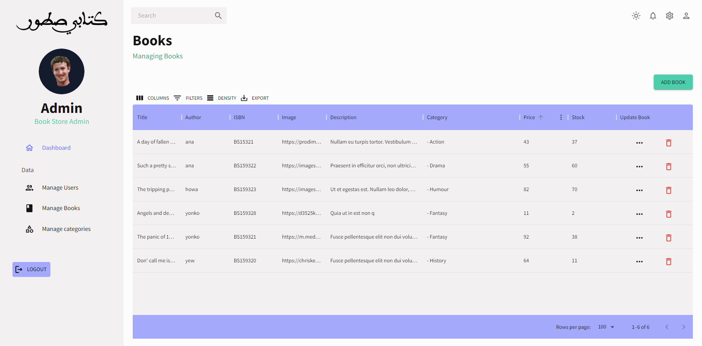

3. **Add New Book**: Admin users can add new books to the catalog by providing book details and uploading cover images.

   

4. **Update Book**: Admin users can update the details of existing books, including title, author, description, pricing, and cover image.

   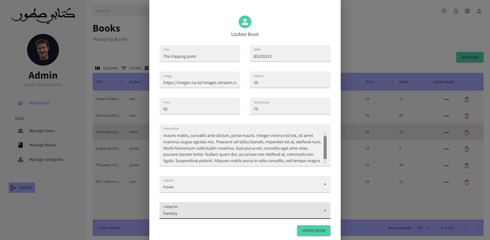

5. **User Management**: Admin users can view and manage user accounts, including account details, order history, and permissions.

   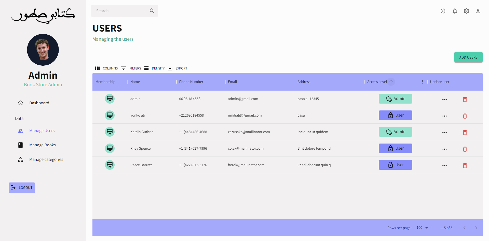

6. **Categories**: Admin users can manage book categories, including adding new categories and updating existing ones.

   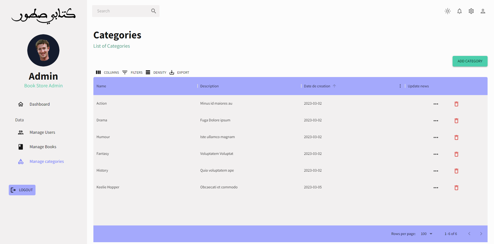

7. **Update Category**: Admin users can update the details of existing categories, including the category name and associated books.

   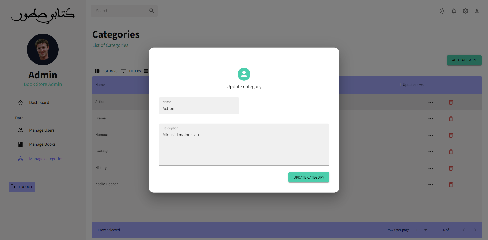

